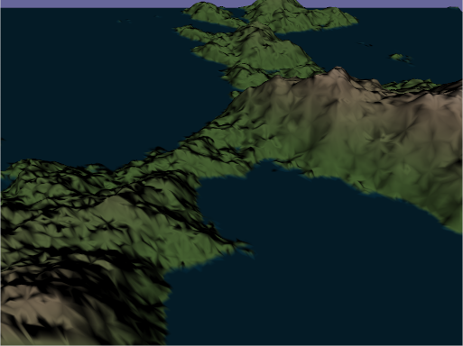
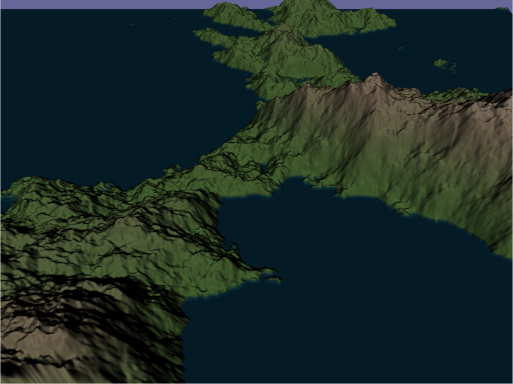

# Terrain Tesselation Sample
This sample creates a terrain based on a height map using a tessellation shader.

## Height Map
The height map is created using a fractional Brownian motion based on Perlin noise during runtime.

## Tessellation Shader

The height is read from the height map in the tessellation evaluation shader and assigned to the geometry. A normal is computed using central differences. The tessellation factor is passed as a uniform variable.

## Keys:

* p: Pause camera animation
* Up/Down: Increase/Decrease tessellation factor
* w: Toggle wire frame
## References
Perlin, Ken (July 1985). "An Image Synthesizer". SIGGRAPH Comput. Graph. 19 (97–8930): 287–296. doi:10.1145/325165.325247.